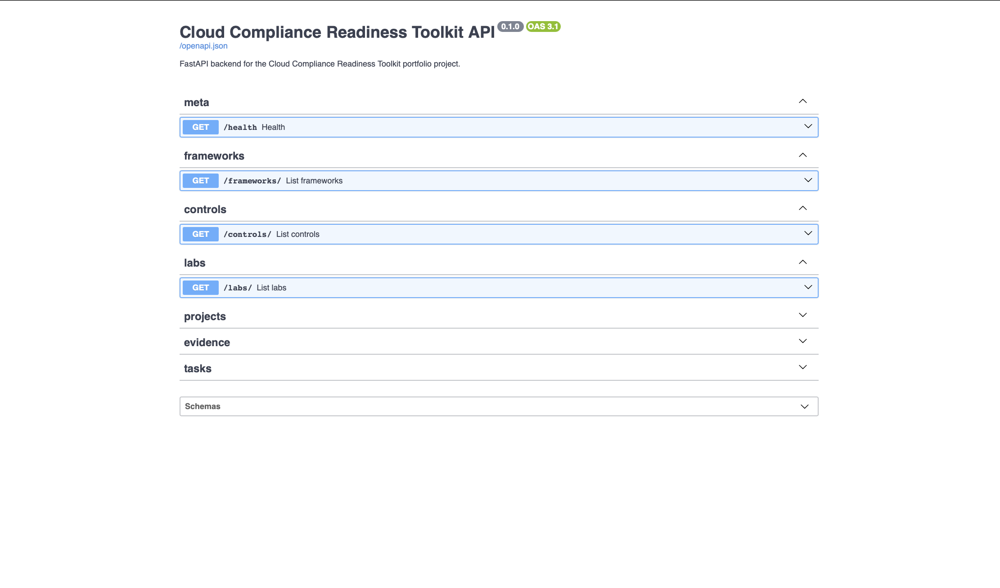
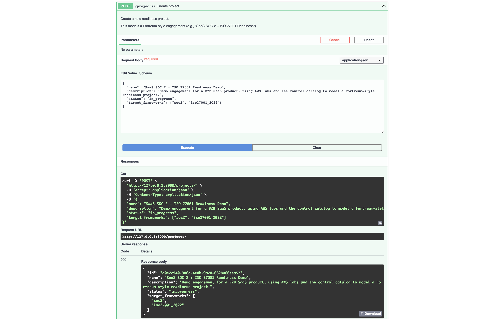
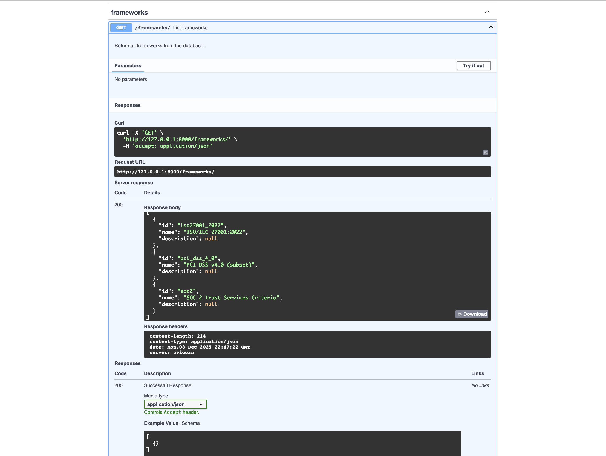
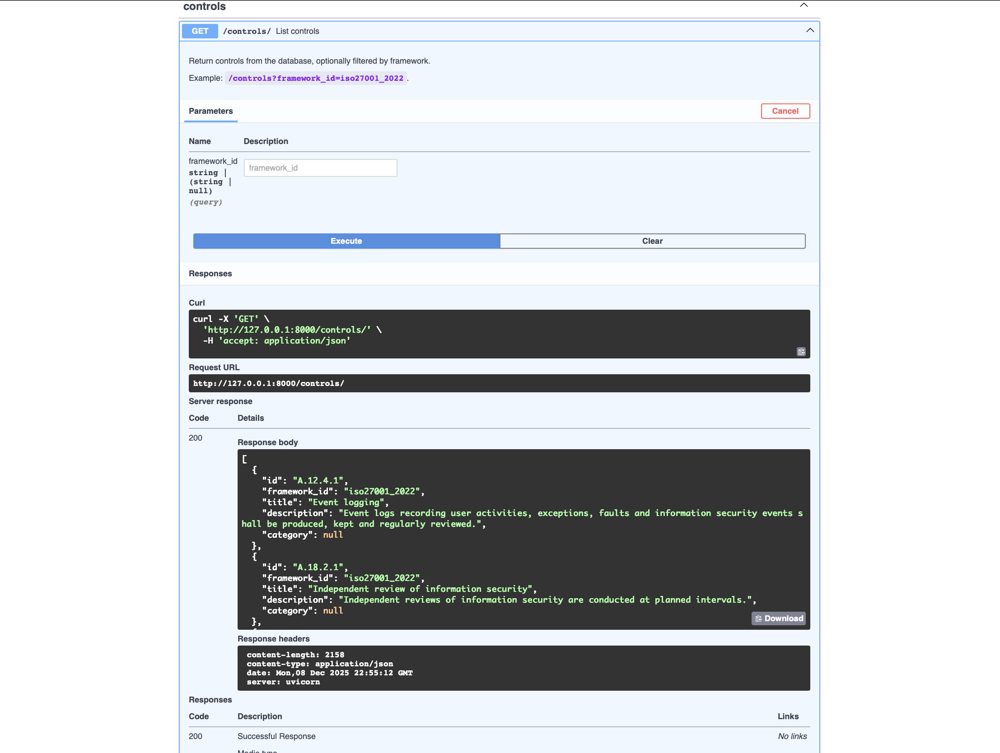
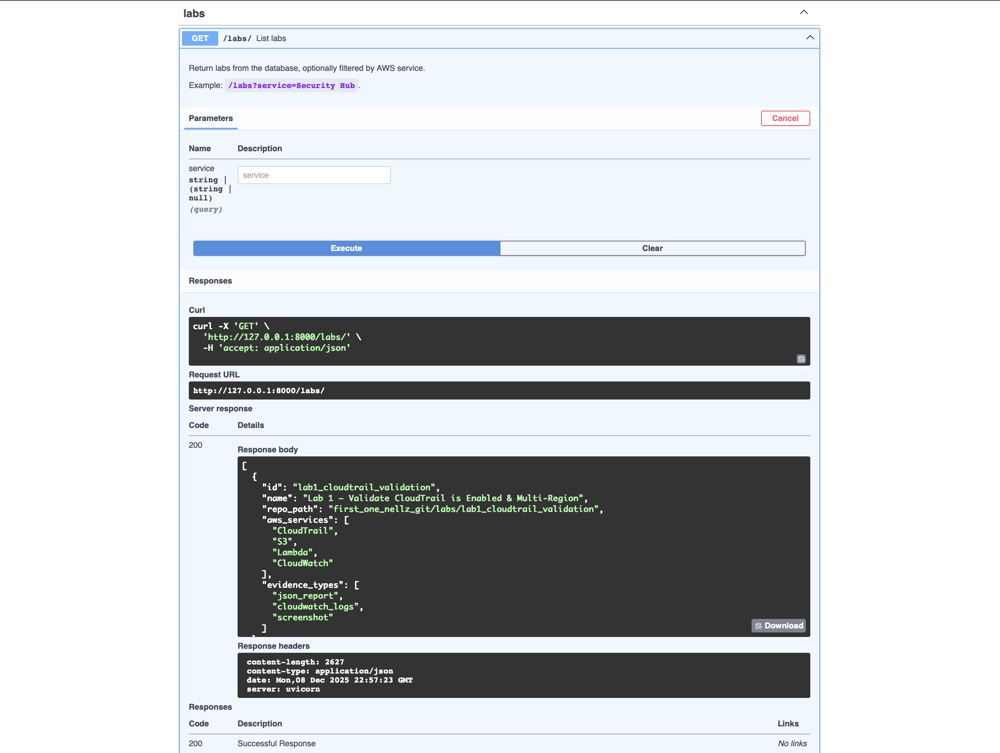
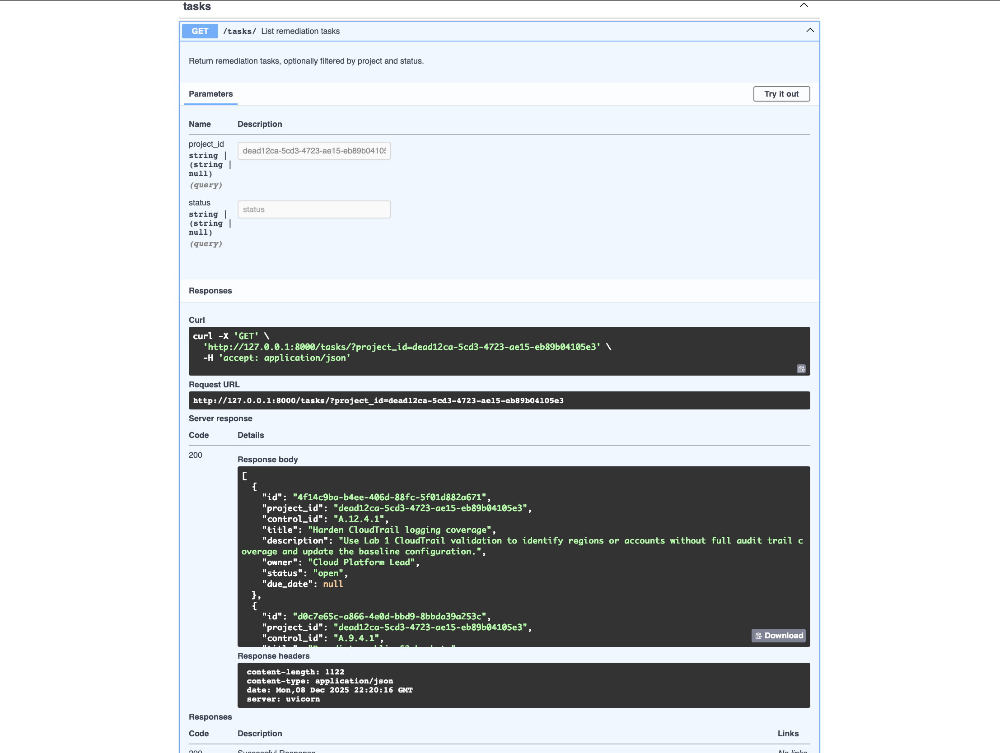
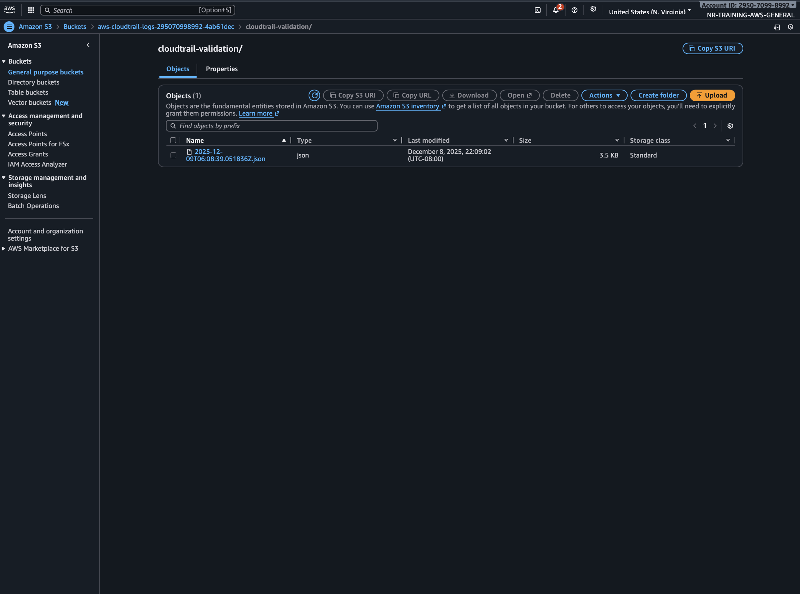
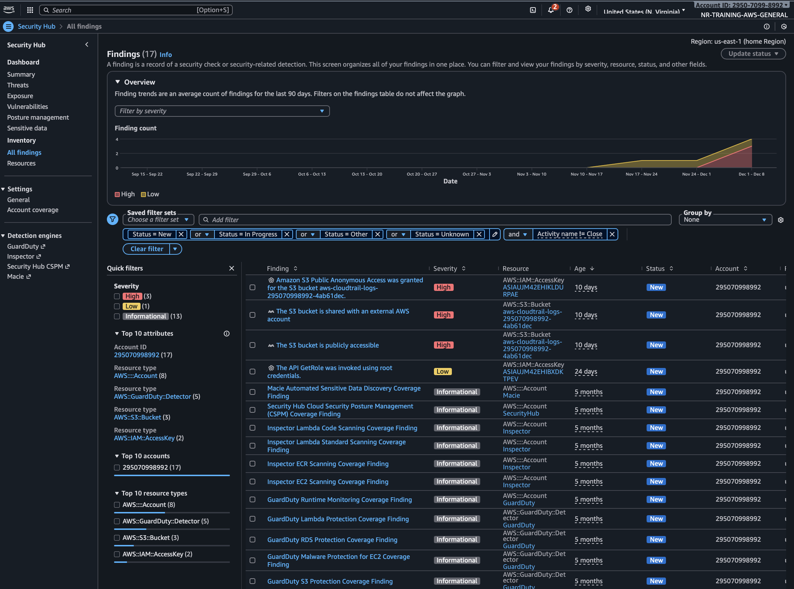
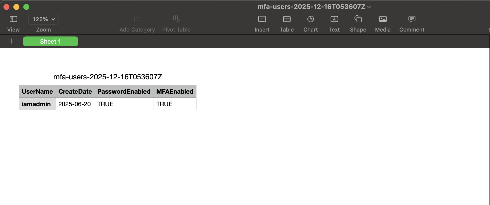
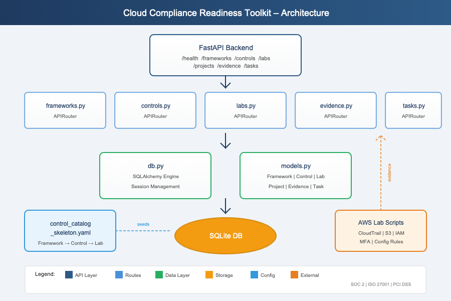

# Cloud Compliance Readiness Toolkit

A portfolio-ready FastAPI application that helps SaaS teams and GRC consultants plan and track SOC 2 / ISO 27001 / PCI DSS readiness.

This toolkit:

- Models compliance **frameworks → controls → labs → evidence** using a control catalog.
- Reuses your existing **AWS GRC labs** (CloudTrail, EC2 inventory, S3 public check, MFA, SG drift, Security Hub insights, IAM role review, audit pack, dashboard).
- Provides an API for **projects, controls, evidence items, and remediation tasks** aligned to Fortreum-style advisory work.

## Tech Stack

- **Backend:** Python, FastAPI
- **Data store:** SQLite (local dev), upgradable to PostgreSQL
- **Schema:** Entities for Framework, Control, Lab, Project, EvidenceItem, RemediationTask
- **Infra (optional for demo):** Uvicorn, GitHub Actions, AWS (S3/CloudFront/Lambda) for deployment

## Getting Started (local)

```bash
python -m venv .venv
source .venv/bin/activate  # Windows: .venv\\Scripts\\activate
pip install -r requirements.txt

uvicorn app.main:app --reload --app-dir backend
```

Then open:

- API docs: http://127.0.0.1:8000/docs
- Health check: http://127.0.0.1:8000/health

## High-Level Features (MVP)

- Read-only APIs for:
  - `/frameworks` – SOC 2 / ISO 27001 / PCI DSS subset
  - `/controls` – individual controls with mappings to labs
  - `/labs` – AWS GRC labs and their evidence types
- Project-oriented models for:
  - `/projects` – readiness engagements
  - `/evidence` – evidence items per control/project
  - `/tasks` – remediation tasks per control/project

## Control Catalog

The control catalog is defined in a YAML file (`control_catalog_skeleton.yaml`) that maps:

- Frameworks (SOC 2 / ISO / PCI)
- Controls (e.g., `CC7.2`, `A.12.4.1`, `Req.10`)
- Labs (e.g., `lab3_s3_public_check`, `lab8_audit_pack_generator`, `lab9_control_dashboard`)
- Evidence types (CSV/JSON reports, Security Hub findings, screenshots, dashboards)

The FastAPI app will later seed its database from this catalog so that UI and APIs stay aligned with your portfolio labs.

## Demo Scenario (End-to-End Flow)

This scenario shows how to use the API to model a Fortreum-style
readiness engagement:

1. **Create a readiness project**
2. **Attach evidence** from AWS labs to specific controls
3. **Create remediation tasks** to track follow-up work

### 1. Create a Readiness Project

`POST /projects`

Example request body:

```json
{
  "name": "SaaS SOC 2 + ISO 27001 Readiness",
  "description": "Prep for initial SOC 2 Type 2 and ISO/IEC 27001:2022 audit.",
  "status": "planning",
  "target_frameworks": ["soc2", "iso27001_2022"]
}
```

Example response shape:

```json
{
  "id": "<project_id>",
  "name": "SaaS SOC 2 + ISO 27001 Readiness",
  "description": "...",
  "status": "planning",
  "target_frameworks": ["soc2", "iso27001_2022"]
}
```

Save the `id` value; it will be used in the next steps.

### 2. Attach Evidence from Labs

Pick a control and lab combination, for example:

- Control: `A.12.4.1` (ISO – Event logging)
- Lab: `lab1_cloudtrail_validation` (CloudTrail multi-region evidence)

`POST /evidence`

```json
{
  "project_id": "<project_id>",
  "control_id": "A.12.4.1",
  "lab_id": "lab1_cloudtrail_validation",
  "type": "json_report",
  "location": "s3://my-audit-evidence-bucket/cloudtrail/2025-12-01.json"
}
```

Example response shape:

```json
{
  "id": "<evidence_id>",
  "project_id": "<project_id>",
  "control_id": "A.12.4.1",
  "lab_id": "lab1_cloudtrail_validation",
  "type": "json_report",
  "location": "s3://...",
  "collected_at": "2025-12-01T12:34:56Z"
}
```

List evidence for the project:

- `GET /evidence?project_id=<project_id>`
- Or filter to a control: `GET /evidence?project_id=<project_id>&control_id=A.12.4.1`

### 3. Create Remediation Tasks

Translate findings into follow-up work.

`POST /tasks`

```json
{
  "project_id": "<project_id>",
  "control_id": "CC6.1.2",
  "title": "Enforce MFA for all IAM users",
  "description": "Use Lab 4 MFA enforcement evidence to identify and close gaps.",
  "owner": "Head of Security",
  "status": "open"
}
```

Example response shape:

```json
{
  "id": "<task_id>",
  "project_id": "<project_id>",
  "control_id": "CC6.1.2",
  "title": "Enforce MFA for all IAM users",
  "description": "...",
  "owner": "Head of Security",
  "status": "open",
  "due_date": null
}
```

List tasks for the project:

- `GET /tasks?project_id=<project_id>`
- `GET /tasks?project_id=<project_id>&status=open`

Together, these steps show an end-to-end readiness workflow: scope the
engagement, collect evidence, and track remediation.

## Screenshots

### API (FastAPI /docs)














### Labs (AWS Automation Evidence)







### Architecture



---

## How This Maps to Fortreum's Role

This toolkit is designed to mirror key responsibilities from Fortreum's
GRC Engineering and Advisory roles:

- **Control mapping & inventory**
  - `/frameworks`, `/controls`, and `/labs` demonstrate the ability to
    map SOC 2 / ISO / PCI controls to real AWS services and automation
    (CloudTrail, EC2, S3, Security Hub, IAM, etc.).
- **Evidence automation**
  - `/evidence` links concrete outputs from AWS labs (CSV/JSON reports,
    Security Hub findings, dashboards) to specific controls within a
    project, similar to how Fortreum would prepare audit-ready
    workpapers.
- **Readiness engagements**
  - `/projects` represents client engagements (for example, "SOC 2 +
    ISO 27001 readiness"), showing how you think about scoping and
    framework selection.
- **Remediation planning & tracking**
  - `/tasks` models the remediation backlog with owner, status, and
    optional due date, mirroring how consultants manage follow-up
    actions from assessments.
- **Storytelling**
  - By combining catalog data, evidence, and tasks, you can walk an
    interviewer through a "day in the life" of a Fortreum engineer:
    translating findings from AWS into clear next steps for
    stakeholders.
